layout: true

```{r setup, include = F}
if (!require(easypackages)) install.packages("easypackages")
library(easypackages)

packages("knitr",
         "rmarkdown",
         "gadenbuie/xaringanExtra",
         "gadenbuie/tweetrmd",
         "hadley/emo",
         prompt = F)

options(htmltools.dir.version = FALSE,
        htmltools.preserve.raw = FALSE)

opts_chunk$set(echo = TRUE,
               fig.align = "center")

xaringanExtra::use_xaringan_extra(c("tile_view", "clipboard"))
xaringanExtra::use_extra_styles(hover_code_line = TRUE,
                                mute_unhighlighted_code = FALSE)
```

<div class="my-footer">
  <div style="float: left;"><span>`r gsub("<br />", ", ", gsub("<br /><br />|<a.+$", "", metadata$author))`</span></div>
  <div style="float: right;"><span>`r metadata$location`, `r metadata$date`</span></div>
  <div style="text-align: center;"><span>`r gsub(".+<br />", " ", metadata$subtitle)`</span></div>
</div>

---

## Using `Git`

In the previous session, you got to know the basics of `Git`. As we have seen, once you have it installed and set up, there are various ways in which you can use `Git`. Besides command line interfaces (CLI), such as [*git bash*](https://gitforwindows.org/) for *Windows* or the Terminal on *MacOS*, there also are Graphical User Interfaces (GUI), such as [*GitHub Desktop*](https://desktop.github.com/) or [*GitKraken*](https://www.gitkraken.com/) (for an overview of `Git` clients with a GUI, see https://git-scm.com/downloads/guis).

While we introduce you to quite a few different tools that can be used for making your research reproducible, for your everyday research practice, it is usually advisable to try to minimize the number of different tools in your workflow.

---

## IDE for `R`

Lucky for us, there are Integrated Development Interfaces (IDE) that can be used with `R` *and* `Git`, so we don't need separate tools for using them. 

While there is more than one IDE that can be used with `R` and `Git`<sup>1</sup>, we will focus on the most popular IDE for `R`, which is *RStudio*.<sup>2</sup>

*Disclaimer*: We assume that most (or all?) of you who work with `R` use *RStudio* or at least have some experience with it . Hence (and for reasons of time), we will not provide an introduction to *RStudio*. If you need a primer or refresher on using *RStudio*, you can check out the [*RStudio* How to Articles](https://support.rstudio.com/hc/en-us/categories/200035113-How-To-Articles).

.small[
.footnote[
[1] A choice that is becoming increasingly popular, also in the `R` community is [*Visual Studio Code*](https://code.visualstudio.com/) - of VSCode for short - by *Microsoft*.

[2] For reasons and more options for using an IDE for `R`, you can check out the [section on IDE](https://rstats.wtf/save-source.html#use-an-ide) in the online book [*What They Forgot to Teach You About R*](https://rstats.wtf/index.html) by Jennifer Bryan and Jim Hester.
]
]

---

## Getting jiggy with `Git` `r ji("man_dancing")`

A really great resource on using `Git` and *GitHub* in combination with `R` and *RStudio* is the website [*Happy Git and GitHub for the useR*](https://happygitwithr.com/) by [Jennifer Bryan](https://jennybryan.org/). Much of the content in this session is based on this resource and it offers a lot of additional helpful information and advice (including some help with troubleshooting commonly encountered issues).

Another good introductory resource is the *RStudio* How To Article on [*Version Control with Git and SVN*](https://support.rstudio.com/hc/en-us/articles/200532077?version=2021.09.0%2B351&mode=desktop).

Similar to *Happy Git and GitHub for the useR*, in this session, we will focus on using *RStudio* and `Git` in combination with *GitHub*.<sup>1</sup>

.small[
.footnote[
[1] However, much of what we cover can also be applied to working with [*GitLab*](https://about.gitlab.com/) or [*Bitbucket*](https://bitbucket.org/).
]
]

---

## All set?

If you have properly set up `Git` as shown in the previous session, *RStudio* should be able to detect it. The easiest way to check this is via the *RStudio* options: *Tools* -> *Global Options* -> *Git/SVN*

```{r git-menu, out.width = "55%", echo=FALSE}
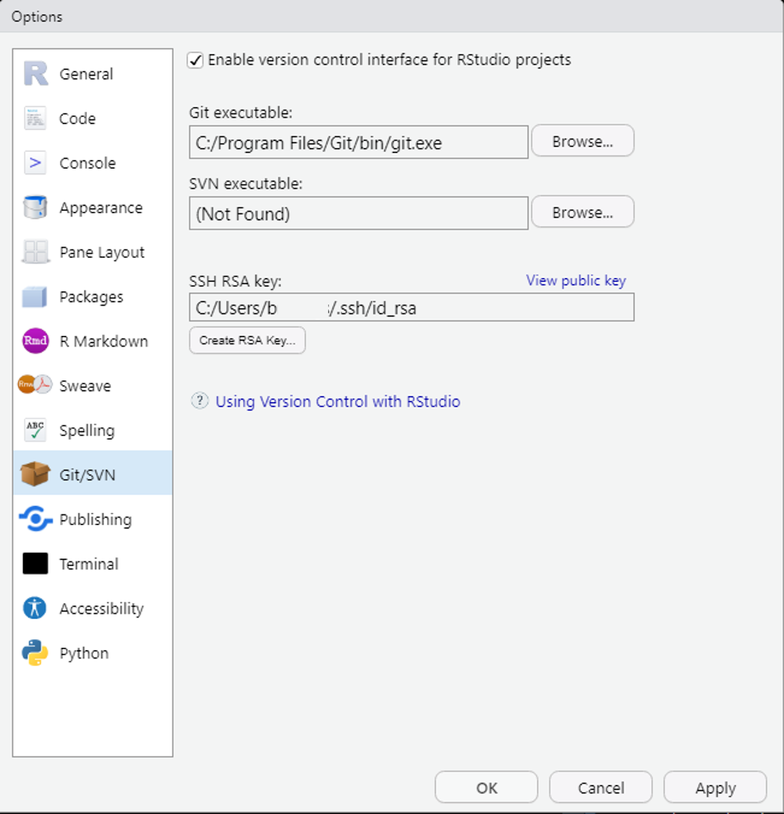
```

---

## Hide & seek `r ji("eyes")`

If *RStudio* cannot detect your local `Git` executable, you need to tell it where to find it via the *Browse* button in the menu shown on the previous slide.

On macOS and Linux, a common path for the `Git` installation is (something like) `/usr/bin/git`, while on Windows it is (something like) `C:/Program Files/Git/bin/git.exe`.

If that does not solve the problem or in case you encounter other issues with using `Git` in *RStudio*, you can check out the troubleshooting section [*RStudio, Git, GitHub Hell*](https://happygitwithr.com/troubleshooting.html) in *Happy Git and GitHub for the useR*.

---

## How to use `Git` in *RStudio*

There are essentially two options for using `Git` via *RStudio*

1. Through the GUI

2. Via the Terminal

*Note*: While we won't cover those in any detail in this session, there are also *R* packages for `Git` operations. The package [`usethis`](https://usethis.r-lib.org/) can, e.g., be used to initialize a `Git` repository or for managing credentials, and the [`gert` package](https://docs.ropensci.org/gert/) is a simple `Git` client for `R` that can be used to perform basic `Git` commands, such as staging, adding, and committing files, or creating, merging, and deleting branches.

---

## Are you legit to `Git`?

As we have discussed in the previous session, there are two protocols for securely communicating with remote `Git` servers, such as *GitHub*: `HTTPS` and `SSH`.

Here, we will focus on using a personal access token (PAT) via `HTTPS`. However, if you want to (or for some reason have to) use `SSH`, you can check out the [chapter on this in *Happy Git and GitHub for the useR*](https://happygitwithr.com/ssh-keys.html).

---

## Creating a PAT

There are two simple ways of creating a PAT:

1. Through the GitHub interface: Go to https://github.com/settings/tokens and click "Generate token". As scopes, you should ideally select "gist", "repo", "user", and "workflow".

2. Using the `create_github_token()` function from the `usethis` package.

```{r create-gh-token, eval = FALSE}
library(usethis)

create_github_token()
```

**NB**: Do not close the browser window/tab with the PAT until you have stored it somewhere. You should treat the PAT like a password.

---

## Storing a PAT

Once you have created a PAT, the simplest way to store it for use with `R` and *RStudio* is using the `gitcreds_set()` function from the [`gitcreds` package](https://gitcreds.r-lib.org/).

```{r store-pat, eval = FALSE}
library(gitcreds)

gitcreds_set()
```

*Note*: Of course, you can also (or additionally) store your PAT in another (safe) place, such as your password manager.

---

## `Git` + *RStudio* = `r ji("heart")`

Now you should hopefully be all set to use `Git` and *GitHub* via *RStudio*.

In order to get the best out of the combination of `R`, *RStudio*, and `Git`, it is strongly recommendable to adopt a ["project-oriented workflow"](https://rstats.wtf/project-oriented-workflow.html). 

Using *RStudio* projects can facilitate several things: the organization of files, the use of (relative) file paths, but also the integration of `R` and `RMarkdown` (more on that later) with `Git`.

---

## Excursus: *RStudio* projects

*RStudio* projects are associated with `.Rproj` files that contain some specific settings for the project. If you double-click on a `.Rproj` file, this opens a new instance of *RStudio* with the working directory and file browser set to the location of that file (the repository/folder for this workshop contains an `.Rproj` file, if you want to try this out).

Explaining *RStudio* projects in detail would be too much of a detour for this course, but if your interested in that, you can check out the [*RStudio* support site](https://support.rstudio.com/hc/en-us/articles/200526207-Using-Projects) or in the [respective chapter in *What They Forgot to Teach You About R*](https://rstats.wtf/project-oriented-workflow.html#rstudio-projectsl).

---

## What comes first? `r ji("chicken")` `r ji("egg")`

In your everyday work, you quite likely need different workflows depending on the temporal order in which things are created or set up: your local project/files, version control with `Git`, and the remote *GitHub* repository. Lucky for us, *Happy Git and GitHub for the useR* has some good pointers for different scenarios:

- [New project, GitHub first](https://happygitwithr.com/new-github-first.html)
- [Existing project, GitHub first](https://happygitwithr.com/existing-github-first.html)
- [Existing project, GitHub last](https://happygitwithr.com/existing-github-last.html)

In this session, we will follow the *New project, GitHub first* approach as that is the simplest scenario and can be used to build on the things we have covered and done in the previous session on `Git`. We will also focus on interacting with `Git` and *GitHub* via the *RStudio* GUI.

---

## `Git` through the GUI

You can perform quite a few `Git` operations via the *RStudio* GUI: You can, e.g., create a new `Git` repository, clone an existing repository (e.g., from *GitHub*), stage and commit changes and push them to a remote repository, or pull changes from there, and merge those with your local changes. We'll go through a few of these common steps in the following.

---

## New `Git` project connected to existing *GitHub* repo

You can create a new version-controlled project that is connected to a remote repository (e.g., on *GitHub*) via *File* -> *New Project* -> *Version Control* in the *RStudio* menu.

```{r vc-proj, out.width = "75%", echo=FALSE}
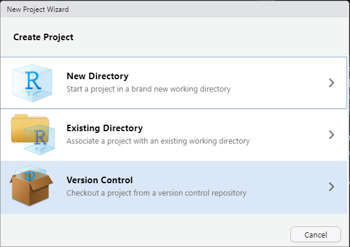
```

---

## New `Git` project connected to existing *GitHub* repo

Next, choose `Git`...

```{r git-proj, out.width = "75%", echo=FALSE}
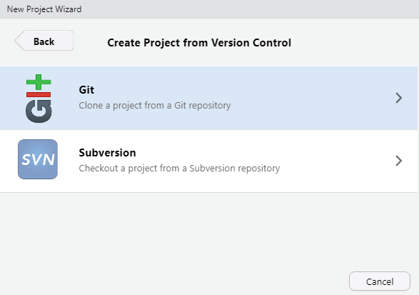
```

---

## New `Git` project connected to existing *GitHub* repo

In the menu that opens after that, enter the URL of the remote repository, give the local repository a name, and tell *RStudio* where it should be stored. It usually makes sense to check "Open in new session".

```{r clone, out.width = "75%", echo=FALSE}
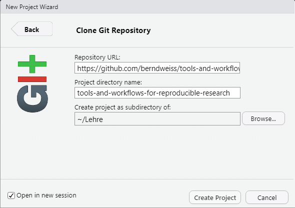
```

---

## Choosing the right URL

Which URL you should enter depends on the authentication method you use. If you use `HTTPS` (as we suggest for this session), you can simply copy the URL from the address bar of your browser. In case you use `SSH`, you can get the right URL via the green *Code* button on the *GitHub* website of the repository.

```{r gh-clone-ssh, out.width = "70%", echo=FALSE}
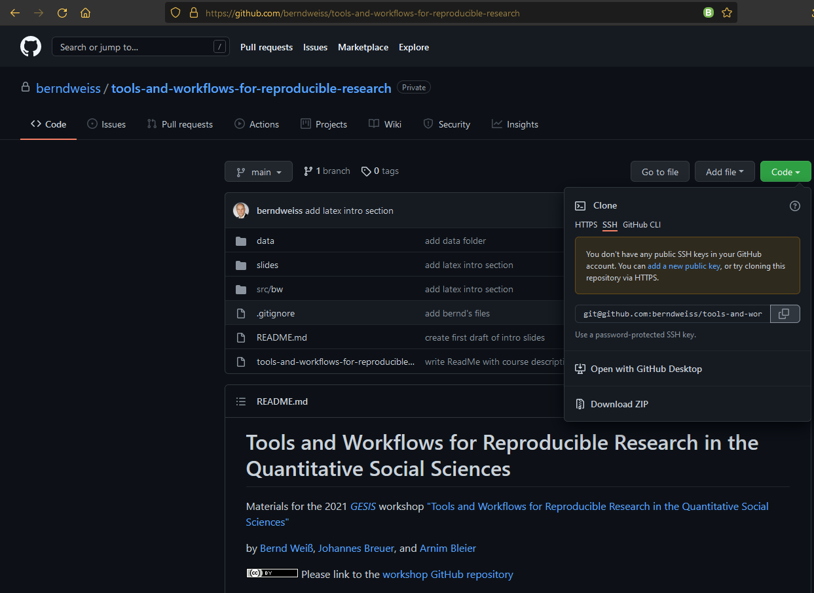
```

---

## Modifying & creating files within the project

Once you have successfully created the project, you can start editing files or creating new ones. For example, you could edit the ReadMe file or create an `R` script right in *RStudio*. When you have modified existing files and/or created new ones and saved the changes, these will be displayed in the `Git` tab in *RStudio* and their status will be indicated as *modified* or *untracked*.

*Note*: The `Git` tab also displays in which branch you are currently working.

```{r files-changed, out.width = "75%", echo=FALSE}
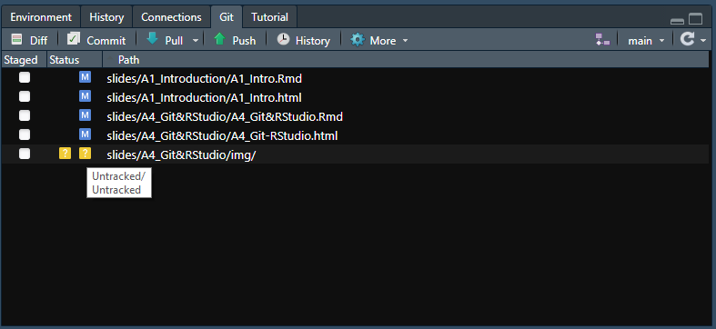
```

---

## Staging changes

Once you have reached a point at which you want to commit (and possibly also push) your changes, you can stage them by checking the boxes in the *Staged* column in the `Git` tab. This the *RStudio* GUI equivalent of `git add`. The status of previously untracked files will then change to *added*.

```{r staged, out.width = "80%", echo=FALSE}
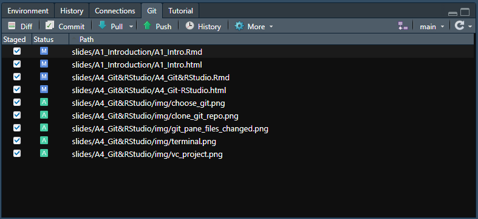
```

---

## Committing & pushing changes

Once you have staged your changes, you can commit them via the *Commit* button in the `Git` tab. In the commit menu that opens you should enter a meaningful commit message. Once that is done you can click the *Commit* button. If you want to, you can also directly push your changes to the remote repository on *GitHub* via the *Push* button. You can, of course, also do this at a later point (directly via the `Git` tab).

```{r commit, out.width = "85%", echo=FALSE}
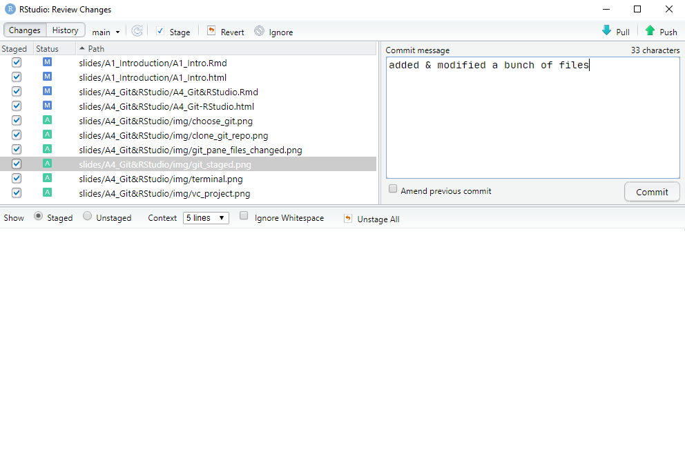
```

---

## Pulling changes from the remote repository

You can also pull changes from the remote repository via the *Pull* button in the `Git` tab. As a general workflow recommendation (especially if you're just getting started with `Git` and *GitHub*) it is usually advisable to first pull from the remote repository before making (and then staging, committing, and pushing) any local changes. This is even more relevant when you collaborate with others on the same repository.

*Important technical note*: If you click the *Pull* button in *RStudio* this will perform a [pull with rebase](http://gitready.com/advanced/2009/02/11/pull-with-rebase.html). Put briefly, pulling with rebase means that local changes are reapplied on top of remote changes. This is [different from pull with merge](https://sdqweb.ipd.kit.edu/wiki/Git_pull_--rebase_vs._--merge). In many scenarios, this is generally the preferable method and nothing you need to worry about. However, in some cases, this can cause issues, and it is good to be aware of this.

---

## Limitations of the GUI

While the *RStudio* GUI can be used for quite a few basic `Git` operations, it has a set of limitations. The first one is the use of specific defaults as is the case with pulling (with rebase). Another one is that it can become quite tedious to stage a large number of files through the GUI. In addition to that, there is a risk of *RStudio* becoming really slow or even crashing if you add/commit a lot of files at the same time and/or very large files. If the overall size of added or altered files is large, the Commit menu in *RStudio* usually also gives a warning about this. 

The *RStudio* GUI is also not the best tool for [handling merge conflicts](https://happygitwithr.com/git-branches.html?q=merge%20conflict#dealing-with-conflicts).


If you want to add/commit a lot of files or large files, want more control over the `Git` commands, or need to use more advanced `Git` operations, the *RStudio* GUI is not the right choice. Instead, you should use a command line interface (CLI). 

---

## Destination `Terminal`

Lucky for us, if you need a CLI for using `Git`, you don't need to leave *RStudio*. As of version 1.3.1056-1 *RStudio* provides a `Terminal` tab in the console pane. Through this, *RStudio* provides access to the [system shell](https://happygitwithr.com/shell.html). If you have properly installed `Git` you can use this to execute the full range of `Git` commands.

---

## Picking shells `r ji("shell")`

Depending on your OS as well as your installation of `Git`, you can pick different shells to be run in the *RStudio* Terminal tab. You can choose those via the *RStudio* Global Options in the *Terminal* menu.

```{r terminal-menu, out.width = "50%", echo=FALSE}
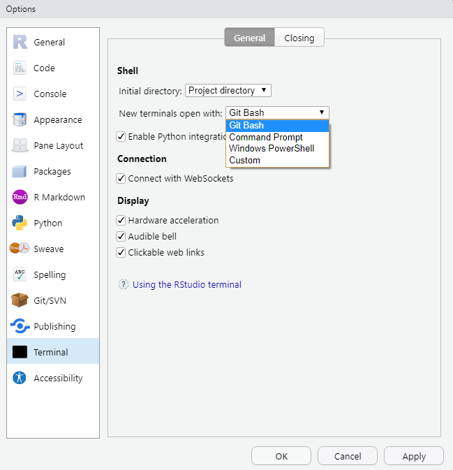
```

---

## The `Terminal` tab

If you use Windows and have installed `Git` for Windows, you should use `Git Bash` as the shell that is run in the *RStudio* terminal (shown in the picture below). On MacOS you should be able to simply use its own `Terminal` in *RStudio*. For some more information on choosing and using the shell in *RStudio*, you can check out the [chapter on this in *Happy Git and GitHub for the useR*](https://happygitwithr.com/shell.html) or the *RStudio* How To Article on [*Using the RStudio Terminal in the RStudio IDE*](https://support.rstudio.com/hc/en-us/articles/115010737148-Using-the-RStudio-Terminal-in-the-RStudio-IDE).

```{r terminal, out.width = "80%", echo=FALSE}
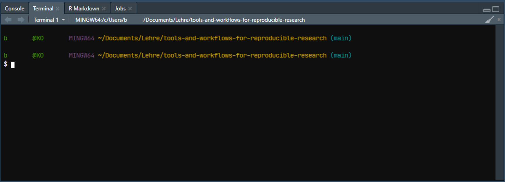
```

---

## Using the `Terminal`

You can use the `Terminal` in *RStudio* to run all available `Git` commands, such as `git status`.

```{r git-status, out.width = "80%", echo=FALSE}
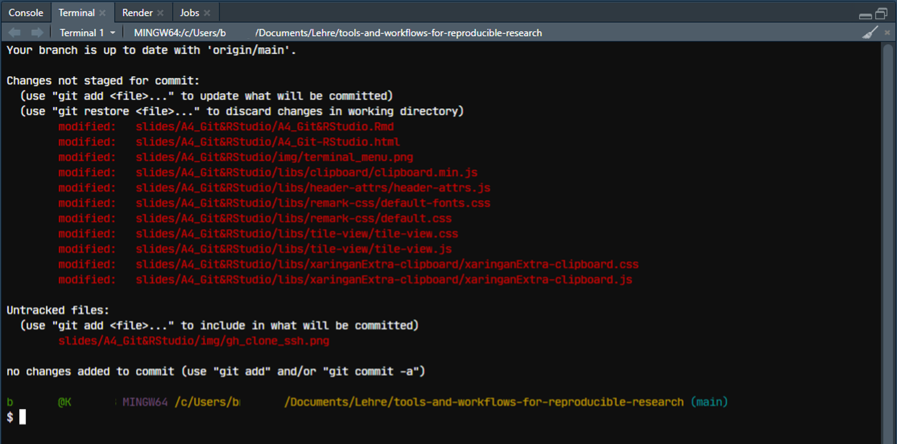
```

---

class: center, middle

# Any questions?

---

class: center, middle

# [Exercise](https://jobreu.github.io/reproducible-research-gesis-2021/exercises/A4_Git-RStudio_exercises_question.html) time `r emo::ji("weight_lifting_woman")``r emo::ji("muscle")``r emo::ji("running_man")``r emo::ji("biking_man")`

## [Solutions](https://jobreu.github.io/reproducible-research-gesis-2021/solutions/A4_Git-RStudio_exercises_solution.html)