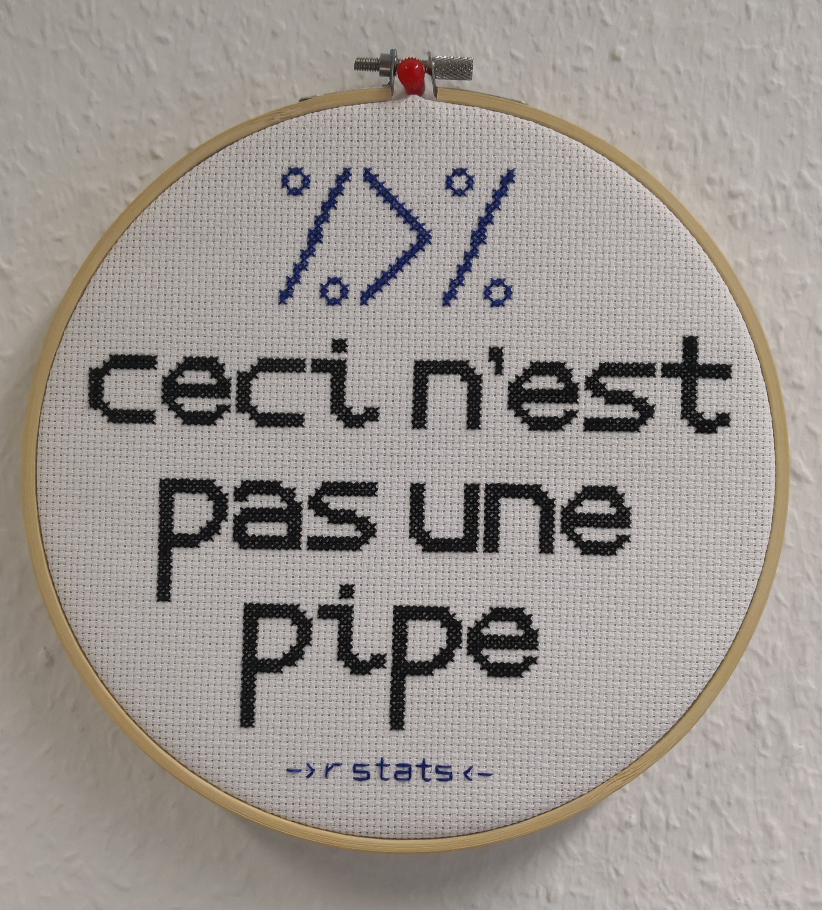

layout: true

```{r setup, include = F}
if (!require(easypackages)) install.packages("easypackages")
library(easypackages)

packages("knitr",
         "rmarkdown",
         "gadenbuie/xaringanExtra",
         "gadenbuie/tweetrmd",
         "hadley/emo",
         prompt = F)

options(htmltools.dir.version = FALSE,
        htmltools.preserve.raw = FALSE)

opts_chunk$set(echo = TRUE,
               fig.align = "center")

xaringanExtra::use_xaringan_extra(c("tile_view", "clipboard"))
xaringanExtra::use_extra_styles(hover_code_line = TRUE,
                                mute_unhighlighted_code = FALSE)
```

<div class="my-footer">
  <div style="float: left;"><span>`r gsub("<br />", ", ", gsub("<br /><br />|<a.+$", "", metadata$author))`</span></div>
  <div style="float: right;"><span>`r metadata$location`, `r metadata$date`</span></div>
  <div style="text-align: center;"><span>`r gsub(".+<br />", " ", metadata$subtitle)`</span></div>
</div>

---

## Producing some content

The main purpose of this session is to produce some meaningful content for the *GitHub* repository we created and interacted with in the previous two sessions. Instead of playing around with the README file, now we will produce some actual `R` code. In the following sessions on `R Markdown`, we will also build on the code we produce in this session.

---

## Focus of this session

In this session, we will focus on tasks of data wrangling. The main reason for this is that while the choice of analysis techniques strongly depends on the research questions and, hence, differs largely between studies, there are some wrangling tasks that are fairly common across research subjects, at least for the same type of data.<sup>1</sup> In our particular case, these will be survey data, which we assume to be a type of data that all of you are familiar with and that many of you use frequently in your research.

.small[
.footnote[
[1] And another one is that I find data wrangling to be great fun `r ji("wink")`
]
]

---

## What is data wrangling?

Data wrangling is the process of "getting the data into shape", so that you can then explore and analyze them.

Common data wrangling steps when working with tabular data in the social & behavioral sciences (e.g., from surveys) include:
- **selecting** a subset of variables
- **renaming** variables
- **filtering** a subset of cases
- **creating/computing** new variables
- **recoding** variables/values (incl. missing values)

--

The (in)famous **80/20-rule**: 80% wrangling, 20% analysis (of course, this ratio relates to the time required for writing the code, not the computing time).

---

## Data wrangling `r ji("cowboy_hat_face")`

```{r, wrangling-cartoon, out.width = "95%", echo = F}
include_graphics("./img/data_cowboy.png")
```
<small><small>Artwork by [Allison Horst](https://github.com/allisonhorst/stats-illustrations)</small></small>

---

## Data wrangling tools in `R`

As with most tasks in `R`, there are different options for data wrangling. In addition to the functionalities provided by `base R`, one popular option is the [`data.table` package](https://rdatatable.gitlab.io/data.table/index.html). And a relatively new contender is the [`datawizard` package](https://easystats.github.io/datawizard/) that is part of [`easystats`](https://easystats.github.io/easystats/) collection of packages.

Another very popular and versatile options for data wrangling (and other tasks) is the `tidyverse`. This is also what we will be using in this session.

---

## What is the `tidyverse`?

> The `tidyverse` is an .highlight[opinionated collection of R packages designed for data science]. All packages share an .highlight[underlying design philosophy, grammar, and data structures] ([Tidyverse website](https://www.tidyverse.org/)).

> The `tidyverse` is a .highlight[coherent system of packages for data manipulation, exploration and visualization] that share a .highlight[common design philosophy] ([Rickert, 2017](https://rviews.rstudio.com/2017/06/08/what-is-the-tidyverse/)).

```{r, out.width = "25%", echo = FALSE}
include_graphics("./img/hex-tidyverse.png")
```

---

## Benefits of the `tidyverse`

.large[  
`Tidyverse` syntax is designed to increase **human-readability**. This makes it especially **attractive for `R` novices** as it can facilitate the experience of **self-efficacy** (see [Robinson, 2017](http://varianceexplained.org/r/teach-tidyverse/)). The `tidyverse` also aims for **consistency** (e.g., data frame as first argument and output) and uses **smarter defaults** (e.g., no partial matching of data frame and column names).
]

---

## The 'dark side' of the `tidyverse`

Many `tidyverse` functions are under heavy development. This can mean that they can be improved and become easier to use, but also that these changes can eventually break your code (although the `tidyverse` developers usually try to ensure backwards-compatibility as much as possible).<sup>1</sup> Recent examples include the changes made to the functions for [converting tables into long or wide format](https://tidyr.tidyverse.org/news/index.html#pivoting) or the [replacement of "scoped variants" of `tidyverse` functions by the `across()` function](https://dplyr.tidyverse.org/reference/across.html). 
  
.small[
.footnote[
[1] To learn more about the `tidyverse` lifecycle you can watch this [talk by Hadley Wickham](https://www.youtube.com/watch?v=izFssYRsLZs) or read the corresponding [documentation](https://lifecycle.r-lib.org/articles/stages.html#deprecated).
]
]

---

## Disclaimer

This session is intended to be a primer or refresher on data wrangling basics with the `tidyverse`. This means that we will mostly only cover simple use cases (although the functions we will discuss - sometimes in combination with additional ones that we do not cover in this session - can be used for much more complex data wrangling tasks).

--

If you are already quite familiar with the `tidyverse` (or even an expert in using it), you are free to "tune out" while we cover its basics for data wrangling in the following. Alternatively, you could, e.g., explore some of the more advanced wrangling functions from the tidyverse, such as conditional recoding with [`case_when()`](https://dplyr.tidyverse.org/reference/case_when.html), applying functions across multiple columns with [`across()`](https://dplyr.tidyverse.org/reference/across.html), or combining different data sets with [two-table verbs](https://dplyr.tidyverse.org/articles/two-table.html?q=join).

--

If you are deeply convinced that you do not want to learn about the `tidyverse`, you could also translate everything we cover in this session into `base R`.

--

That being sad, let's take a dive into the `tidyverse`...

---

## `tidyverse` vocababulary

Before we get started, we'll briefly talk about two key `tidyverse` terms:

1. Tibbles

2. Pipes

---

## Tibbles

Tibbles are basically just `R data.frames` but nicer.

- only the first ten observations are printed
  - output is tidier!
  
- you get some additional metadata about rows and columns that you would normally only get when using `dim()` and other functions

You can check the [tibble vignette](https://cran.r-project.org/web/packages/tibble/vignettes/tibble.html) for technical details.

---

## What's a pipe?

```{r magrittr, echo=FALSE, out.width="50%"}

```

.small[
Source: Johannes' GESIS office wall
]

---

## The logic of pipes

Usually, in `R` we apply functions as follows:

```{r function-r, echo = TRUE, eval = FALSE}
f(x)
```

In the logic of pipes this function is written as:

```{r function-pipe, echo = TRUE, eval = FALSE}
x %>% f(.)
```

--

We can use pipes on more than one function:

```{r function-pipe-2, echo = TRUE, eval = FALSE}
x %>% 
  f_1() %>% 
  f_2() %>% 
  f_3()
```

More details: https://r4ds.had.co.nz/pipes.html

---

## `tidyverse` resources

In this session, we will only cover some of the basics of `tidyverse` options for data wrangling. However, there are hundreds of tutorials, courses, blog posts, etc. about the `tidyverse` available online. The book [*R for Data Science*](https://r4ds.had.co.nz/) by [Hadley Wickham](http://hadley.nz/) and [Garrett Grolemund](https://twitter.com/statgarrett) (which is available for free online) provides a very comprehensive introduction to the `tidyverse`.

The weekly [Tidy Tuesday](https://github.com/rfordatascience/tidytuesday) data projects and the associated [#tidytuesday Twitter hashtag](https://twitter.com/hashtag/tidytuesday?lang=en) are also fun ways of learning and practicing data wrangling and exploration with the `tidyverse`.

---

## Data for this session

In this session (and the following ones), we will use a synthetic data set based on the data from the [*GESIS Panel Special Survey on the Coronavirus SARS-CoV-2 Outbreak in Germany*](https://search.gesis.org/research_data/ZA5667). This synthetic data set was created by Bernd using the [`synthpop` package](https://www.synthpop.org.uk/).
Apart from being synthetic, the data we use here differ from the original data set in two ways: They only include numeric variables (and no value or variable labels), and all values < 0 have been recoded as `NA`.

Original data set:

GESIS Panel Team (2020). *GESIS Panel Special Survey on the Coronavirus SARS-CoV-2 Outbreak in Germany*. GESIS Data Archive, Cologne. ZA5667 Data file Version 1.1.0, [https://doi.org/10.4232/1.13520](https://doi.org/10.4232/1.13520)

---

## Coding along

If you want to code along during this session, your working directory should be version-controlled project folder synced with *GitHub* that you created in the previous session. 

You can copy the data we are going to use from the workshop materials. We will be working with the `ZA5667_v1-0-0_CSV_synthetic-data.csv` file from the `data` folder. This should also be stored in a subfolder called `data` in your project folder. 

When you write an `R` script for this session, we suggest that you store that in a folder named `src` within the project folder.

---

## Lift-off into the `tidyverse` `r ji("rocket")`

**Install all `tidyverse` packages** (for the full list of `tidyverse` packages see [https://www.tidyverse.org/packages/](https://www.tidyverse.org/packages/))
```{r install tidyverse, eval = F, echo = T}
install.packages("tidyverse")

```
**Load core `tidyverse` packages** (NB: To save time and reduce namespace conflicts it can make sense to load the `tidyverse` packages individually)

```{r load tidyverse, eval = T, echo = T, message = T}
library("tidyverse")

```

---

## Getting data into the `tidyverse`

`base R` already provides tools for importing data
- e.g., `read.csv()` for importing Comma Separated Value (CSV) files

The `tidyverse` extends these options through a set of packages:
- `readr`  (for 'flat' files, such as `CSV`)
- `haven`  (for statistical software files, such as *SPSS*, *Stata*, and *SAS*; can also handle labelled data)
- `readxl` (for *Excel* spreadsheets)

```{r, out.width = "50%", echo = FALSE}

```

A key difference between these packages and others is that `tidyverse` import functions already prepare the data for being 'tidied' by importing them as `tibbles`.

---

## Loading our data set

We will be working with the `CSV` version of the data. To load them we will use a function from the `readr` package.

```{r load-data-display, eval = FALSE}
gp_covid <- read_csv("../data/ZA5667_v1-0-0_CSV_synthetic-data.csv")
```

```{r load-data, echo = FALSE, message = TRUE}
gp_covid <- read_csv("../../data/ZA5667_v1-0-0_CSV_synthetic-data.csv")
```

Note the column specifications. `readr` 'guesses' them based on the first 1000 observations.

---

### What's in the data?

To get a first impression of our data we can use the `tidyverse` function `glimpse()`.

```{r glimpse, eval=FALSE}
glimpse(gp_covid)
```

.right[`r emo::ji("left_arrow_curving_right")`]

---

class: middle

.tiny[
```{r ref.label = "glimpse", echo = FALSE}
```
]

---

## What's in the data?

To know what the variables represent, we can consult the [codebook](https://dbk.gesis.org/dbksearch/download.asp?id=67378) for the original data. In general, the *GESIS Panel* website provides very [detailed documentation](https://www.gesis.org/gesis-panel/documentation) for the studies. The [*GESIS Panel* cheatsheet](https://www.gesis.org/fileadmin/upload/GESIS_Panel/Cheatsheet/gesis_panel_cheatsheet.pdf) is particularly helpful for understanding the data structure and variable naming scheme.

---

## `dplyr`

The `tidyverse` examples in the following will make use of functions from the [`dplyr` package](https://dplyr.tidyverse.org/):

- `dplyr` functions are verbs that signal an action 

- first argument = a data frame

- the output normally also is a data frame (tibble)

- columns (= variables in a tidy data frame) can be referenced without quotation marks (non-standard evaluation)

- actions (verbs) can be applied to columns (variables) and rows (cases/observations)

---

## Creating subsets

Oftentimes, we want to reduce our data frame (or create a new one) to only include a subset of variables that we are interested in for our analyses (especially if we are working with extensive survey data, such as those from the *GESIS Panel*). 

Say, for example, we are only interested in the variables from our data set that measure the risk of becoming infected with or spreading the Corona virus. From looking at the [codebook](https://dbk.gesis.org/dbksearch/download.asp?id=67378), we can see that the names of the variables we are interested in are `hzcy001a`, `hzcy002a`, `hzcy003a`, `hzcy004a`, and `hzcy005a`.

---

## Selecting variables

In the `tidyverse`, we can create a subset of variables with the `dplyr` verb `select()`.

```{r select}
gp_covid_risk <- gp_covid %>% 
  select(hzcy001a,
         hzcy002a,
         hzcy003a,
         hzcy004a,
         hzcy005a)

head(gp_covid_risk)
```

---

## Selecting a range of variables

There also is a shorthand notation for selecting a set of consecutive columns with `select()`.

```{r select-range}
gp_covid_risk <- gp_covid %>% 
  select(hzcy001a:hzcy005a)

head(gp_covid_risk)
```

---

## Renaming variables

As the variable names are not self-explanatory, we might want to change them. We will use `r ji("snake")` *snake_case* in our example. Renaming variables can be done with the `rename()` function from `dplyr`.

```{r rename}
gp_covid_risk <- gp_covid_risk %>% 
  rename(risk_self = hzcy001a, # new_name = old_name
         risk_surroundings = hzcy002a,
         risk_hospital = hzcy003a,
         risk_quarantine = hzcy004a,
         risk_infect_others = hzcy005a)

names(gp_covid_risk)
```

---

## Re~~wind~~name selecta

A nice thing about the `dplyr` verb `select` is that you can use it to select and rename variables in one step.

.small[
```{r select-rename}
gp_covid_risk <- gp_covid %>% 
  select(risk_self = hzcy001a,
         risk_surroundings = hzcy002a,
         risk_hospital = hzcy003a,
         risk_quarantine = hzcy004a,
         risk_infect_others = hzcy005a)

head(gp_covid_risk)
```
]

---

## Filtering rows

Another thing we also often want to do as part of our data wrangling is selecting only a subset of cases. In `R`, you can filter rows/observations dependent on one or more conditions.

To filter rows/observations you can use... 
- **comparison operators**:
    - **<** (smaller than)
    - **<=** (smaller than or equal to)
    - **==** (equal to)
    - **!=** (not equal to)
    - **>=** (larger than or equal to)
    - **>** (larger than)
    - **%in%** (included in)

---

## Filtering rows

... and combine comparisons with
- **logical operators**:
    - **&** (and)
    - **|** (or)
    - **!** (not)
    - **xor** (either or, not both)

---

## Filtering rows

The `dplyr` solution for filtering rows/observations is the verb `filter()`.

```{r dplyr-filter}
gp_covid_male <- gp_covid %>% 
  filter(sex == 1)

dim(gp_covid_male)
```

---

## `dplyr::filter()`

```{r, filter-cartoon, out.width = "95%", echo = F}
include_graphics("./img/dplyr_filter.jpg")
```
<small><small>Artwork by [Allison Horst](https://github.com/allisonhorst/stats-illustrations) </small></small>

---

## Creating & transforming variables

Something we commonly want to do as part of our data wrangling procedures is transforming existing variables or creating new ones. The `dplyr` package offers the very versatile `mutate()` function for this that can, e.g., be used for simple linear transformations of variables, changing variable types, or recoding values of variables.

---

## Simple transformations

Say, we want to recode the `sex` variable in our data from 1 meaning male and 2 meaning female to 0 meaning male and 1 meaning female. As this is a numeric variable, we can simply substract 1 from its value to create the new variable.

```{r mutate-transform}
gp_covid <- gp_covid %>% 
  mutate(sex_new = sex - 1)

table(gp_covid$sex, gp_covid$sex_new)
```

*Note*: In case you want to overwrite a variable, you can do so by giving the new variable the same name as the old one.

---

## `dplyr::mutate()`

```{r, mutate-cartoon, out.width = "60%", echo = F}
include_graphics("./img/dplyr_mutate.png")
```
<small><small>Artwork by [Allison Horst](https://github.com/allisonhorst/stats-illustrations)</small></small>

---

## Recoding values

Very often we want to recode values in a variable (e.g., if we have reverse-scored items as part of a scale). Say, for example, you want to recode the item from the *GESIS Panel Special Survey on the Coronavirus SARS-CoV-2 Outbreak in Germany* that measures trust in scientists with regard to dealing with the Coronavirus so that it represents distrust instead. In that case, we could combine the two `dplyr` functions `mutate()` and `recode()`.

.small[
```{r recode}
gp_covid <- gp_covid %>% 
  mutate(hzcy052aR = recode(hzcy052a,
                           `5` = 1, # `old value` = new value
                           `4` = 2,
                           `2` = 4,
                           `1` = 5))

table(gp_covid$hzcy052aR, gp_covid$hzcy052a, useNA = "always")
```
]

---

## Recode values as `NA`

While all values < 0 have already been recoded as `NA` in the process of creating the synthetic data set, as the output on the previous slide has shown, there are some values that we also might want to treat as missing, such as 97 and 98 (you can have a look at the [codebook](https://dbk.gesis.org/dbksearch/download.asp?id=67378) to see what they mean).

While there are more sophisticated methods for recoding missing values (the "tidyverse-adjacent" [`naniar` package](http://naniar.njtierney.com/) offers some good solutions for this), in our case, we just want to recode the values 97 and 98 as `NA` for the entire data set. An easy option for doing this is the `dplyr` function `na_if()`.

```{r na-if-df}
gp_covid <- gp_covid %>% 
  na_if(97) %>% 
  na_if(98)

table(gp_covid$hzcy052a, useNA = "always")
```

---

class: center, middle

# [Exercise](https://jobreu.github.io/reproducible-research-gesis-2021/exercises/A5_Data_Wrangling_exercises_question.html) time `r emo::ji("weight_lifting_woman")``r emo::ji("muscle")``r emo::ji("running_man")``r emo::ji("biking_man")`

## [Solutions](https://jobreu.github.io/reproducible-research-gesis-2021/solutions/A5_Data_Wrangling_exercises_solution.html)