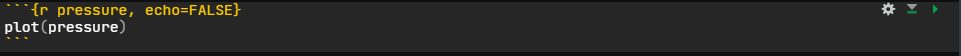

layout: true

```{r setup, include = F}
if (!require(easypackages)) install.packages("easypackages")
library(easypackages)

packages("knitr",
         "rmarkdown",
         "gadenbuie/xaringanExtra",
         "gadenbuie/tweetrmd",
         "hadley/emo",
         "tidyverse",
         prompt = F)

options(htmltools.dir.version = FALSE,
        htmltools.preserve.raw = FALSE)

opts_chunk$set(echo = TRUE,
               fig.align = "center")

xaringanExtra::use_xaringan_extra(c("tile_view", "clipboard"))
xaringanExtra::use_extra_styles(hover_code_line = TRUE,
                                mute_unhighlighted_code = FALSE)
```

<div class="my-footer">
  <div style="float: left;"><span>`r gsub("<br />", ", ", gsub("<br /><br />|<a.+$", "", metadata$author))`</span></div>
  <div style="float: right;"><span>`r metadata$location`, `r metadata$date`</span></div>
  <div style="text-align: center;"><span>`r gsub(".+<br />", " ", metadata$subtitle)`</span></div>
</div>

---

## What is `R Markdown`?

>R Markdown provides an unified authoring framework for data science, .highlight[combining your code, its results, and your prose commentary]. R Markdown documents are .highlight[fully reproducible] and .highlight[support dozens of output formats], like PDFs, Word files, slideshows, and more ([R for Data Science](https://r4ds.had.co.nz/r-markdown.html)).

--

`R Markdown` is...

- an authoring framework

--

- a [literate programming](https://en.wikipedia.org/wiki/Literate_programming) tool

--

- a document format (`.Rmd`)

--

- an `R` package

---

## What is `R Markdown`?

.center[
.huge[
[Markdown](https://en.wikipedia.org/wiki/Markdown) + `R`
]
]

TL;DR of the Wikipedia article: `Markdown` is a lightweight language for text formatting.

---

## What does `R Markdown` do?

```{r, rmarkdown-rocks-cartoon, out.width = "75%", echo = F}
include_graphics("./img/rmarkdown_rockstar.png")
```
<small><small>Artwork by [Allison Horst](https://github.com/allisonhorst/stats-Artworks) </small></small>

---

## What can you do with `R Markdown`?

In a nutshell, with `R Markdown` it is possible to produce dynamic documents which...

- include text, code, and output from that code

--

- render to many different output formats, including:
  + `HTML`
  + `Markdown`
  + `PDF`
  + *Microsoft Word*
  + Open Document
  + `RTF`

For a [full list of supported output formats](https://rmarkdown.rstudio.com/docs/reference/index.html#section-output-formats) see the `rmarkdown` package documentation.

---

## `R Markdown` and reproducibility

As it combines code, text, and outputs, `R Markdown` is a great tool for producing reproducible publications (papers, project reports, etc.).

```{r, rmarkdown-repro-cartoon, out.width = "70%", echo = F}
include_graphics("./img/reproducibility_court.png")
```
<small><small>Artwork by [Allison Horst](https://github.com/allisonhorst/stats-Artworks) </small></small>

---

## What we will cover

Covering everything you can do with `R Markdown` or even exploring all options for specific kinds of outputs, such as presentations or scientific publications, in-depth would be enough for separate workshops. Hence, this session will only cover the basics of `R Markdown`. We will also focus on `HTML` output. 

In the second session tomorrow, we will explore some more advanced uses of working with `R Markdown` and especially also combining it with $\LaTeX$.

---

## Getting started with `R Markdown`

If you use *RStudio* you only need to install the `R Markdown` package:

```{r rmarkdown-requirements, eval = F}
install.packages("rmarkdown")
```

*Note*: If you do not have *RStudio* installed, you also need to [install Pandoc](https://pandoc.org/installing.html).

---

## Getting started with `R Markdown`

You can create a new `R Markdown` document in *RStudio* via *File* -> *New File* -> *R Markdown* in the menu. This will open a new window in which you can set the author and title and pick an output format for your document.

```{r, rmarkdown-menu, out.width = "50%", echo = F}

```

---

## Getting started with `R Markdown`

When you create a new `R Markdown` document in *RStudio*, the new document will include a basic template to which I added a few lines about inline code at the end in the example below.

```{r, rmarkdown-example, out.width = "55%", echo = F}

```

---

## Anatomy of an `R Markdown` document

```{r, rmarkdown-annotated, out.width = "65%", echo = F}

```

---

## YAML header

```{r yaml-101, eval = F}
---
title: "My First R Markdown Document"
subtitle: "A first in the series of many more to come"
author: "Gordon Shamway"
date: "17-11-2021"
output: html_document
---
```

[YAML](https://yaml.org/) stands for "YAML Ain't Markup Language" (formerly known as "Yet Another Markup Language"). The YAML header in `R Markdown` documents contains metadata for the document. It provides human-readable configuration information and can include a large variety of key:values-pairs to specify what the document should look like. It needs to be at the beginning of the document and start and end with `---`.

*Note*: There is an `R` package called [`ymlthis`](https://ymlthis.r-lib.org/) for creating extended YAML headers in and with `R`.

---

## `(R) Markdown` formatting

While it is not necessary to know `Markdown` to use `R Markdown` (though if you want to know more, you can, e.g., check out the [Markdown Guide](https://www.markdownguide.org/) or this [interactive tutorial](https://commonmark.org/help/tutorial/)), it helps to know some of the basics of `Markdown` text formatting as they are the same for `R Markdown`.

---

## Text formatting

.pull-left[
### Syntax

```
***bold**

**italics*

****bold & italics***

~~strikethrough~~
```
]

.pull-right[
### Output

**bold**

*italics*

***bold & italics***

~~strikethrough~~
]

---

## Headers

.pull-left[
### Syntax

```
# Header 1

## Header 2

### Header 3
```
]

.pull-right[
### Output

# Header 1

## Header 2

### Header 3
]

---

# Paragraphs

A new paragraph is started with a blank line before the text. 

**NB**: If you just hit Enter/Return to move text to a new line in an `R Markdown` document, the text you enter after that will not be on a new line in the output document.

*Note*: When you generate `HTML` output, you can also use `HTML` commands in your `R Markdown` document. So, for example, you could insert an empty line with `<br>`.

---

## Lists

.pull-left[
### Syntax

```
- unordered list
  + sub-item

1. ordered list
2. ordered list
  + sub-item
  + sub-item
```
]

.pull-right[
### Output

- unordered list
  - sub-item

1. ordered list
2. ordered list
  + sub-item
  + sub-item
]

---

## Other formatting stuff

.pull-left[
### Syntax

```
`library(tidyverse)`

[link](https://www.gesis.org)

> block quote

 
```
]

.pull-right[
### Output

`library(tidyverse)`

[link](https://www.gesis.org)

> block quote

```{r Rlogo, out.width = "20%", echo = FALSE}
include_graphics("./img/RLogo.png")
```
]


For more formatting options check out the [RMarkdown Reference Guide](https://rstudio.com/wp-content/uploads/2015/03/rmarkdown-reference.pdf) which is also available in *RStudio* via *Help* -> *Cheatsheets* -> *R Markdown Reference Guide*.

---

## Code chunks

```{r code-chunk, echo = F}
include_graphics("./img/code_chunk.png")
```

As the name says, code chunks in `R Markdown` documents include code. This is typically `R` code, but other languages are supported as well (e.g., `Python` or `SQL`). The code is executed when the file is knitted (we'll talk about what this means in a bit). 

You can insert a code chunk via the `Insert` button (select `R`) or using the keyboard shortcut <kbd>Ctrl + Alt + I</kbd> (*Windows* & *Linux*)/<kbd>Cmd + Option + I</kbd> (*Mac*). 

*Note*: It is possible to [render an `R` script into an `R Markdown` report](https://bookdown.org/yihui/rmarkdown-cookbook/spin.html) using `knitr::spin` and, vice versa, to [convert an `R Markdown` document to an `R` script](https://bookdown.org/yihui/rmarkdown-cookbook/purl.html) via `knitr::purl()`.

---

## Code chunks

It is good practice to name code chunks. In the example on the previous slide `{r cars}` specifies the language for the code `r` and a name `cars`. By naming code chunks it is, e.g., possible to reference them in other code chunks and they will also appear in the interactive ToC at the bottom of the tab for the `R Markdown` document. Chunk names may never be used twice in a single document and should not include spaces or underscores.

---

## Chunk options

```{r chunk-options, echo = F}

```

You can also set a variety of options for code chunks. In the above example, we set `echo = FALSE` which means that the code itself will not be displayed in the output document (only its output). Other exemplary chunk options are `eval = FALSE`, meaning that the code is not executed, or `warning = FALSE` or `message = FALSE` which mean that warnings or messages produced by the code are not shown in the output document. Yihui Xie, the main author of the `knitr` package, keeps an [updated list of all code chunk options](https://yihui.org/knitr/options/). 

---

## Setup chunk

```{r setup-chunk, echo = F}
include_graphics("./img/setup_chunk.png")
```

It generally makes sense to include a setup chunk in your document (right after the YAML header). Here you can set global options for your code chunks (which can be overridden by setting options for individual chunks), general options for `R`, or already load packages.

---

## Inline code

```{r inline-code, echo = F}

```

It is also possible to execute code within text. That way, the output is automatically updated if it is compiled again after the input (usually the data) has changed. Inline code needs to be enclosed in `backticks` and has to start with a specification of the language (typically `r`) if the code should be executed when the document is compiled. Only the result(s) of the inline code (not the code itself) will be displayed in the output document.

---

## Comments

It is also possible to include comments in an `R Markdown` document that will not be displayed in the output. 

To comment something out, you can select it and use the keyboard shortcut <kbd>Ctrl + Shift + C</kbd> (*Windows* & *Linux*)/<kbd>Cmd + Shift + C</kbd> (*Mac*). 

A comment in `R Markdown` looks like this: `<!-- This is a comment -->` 

---

## Knitting `r ji("yarn")`

To compile the `R Markdown` document (in this case into a `HTML`) document, you simply need to click the `Knit` `r ji("yarn")` button. Doing this will generate the `HTML` file (by default) in the directory where the `.Rmd` file is stored. It will also open a preview window in *RStudio*.

```{r, rmarkdown-preview, out.width = "55%", echo = F}
include_graphics("./img/rmarkdown_preview.png")
```

---

## Things to know about knitting in *RStudio*

The knitting process happens in a new environment. The working directory for this will (by default) be the directory in which the `.Rmd` file is stored. This is important, e.g., for setting file paths in the `.Rmd` document. This also means that this process will not have access to any of the objects or functions you have created as well as packages you have loaded in the current session.

When you are new to `R Markdown` it makes sense to knit early and knit often to see if everything works and produces the results you expected (unless your document is computationally intensive and, hence, takes a long time to compile).

*Note*: For computationally intensive tasks, you could consider setting the option `opts_chunk$set(cache = TRUE)`. It will cache chunk calls and their results as long as you do not edit them.

---

## How `R Markdown` works

Behind the scenes, `R Markdown` uses [`knitr`](https://yihui.org/knitr/) to execute the code and create a `Markdown` (`.md`) document with the code and output included, and [`pandoc`](https://pandoc.org/) to convert to a range of different output formats. Again, both of them are included when you install *RStudio*.

```{r, rmarkdown-process, out.width = "70%", echo = F}
include_graphics("./img/rmarkdown_process.png")
```
<small><small>Figure by [Andrew Collier](https://github.com/datawookie)</small></small>

---

## How `R Markdown` works

```{r, rmarkdown-wizards-cartoon, out.width = "85%", echo = F}
include_graphics("./img/rmarkdown_wizards.png")
```
<small><small>Artwork by [Allison Horst](https://github.com/allisonhorst/stats-Artworks) </small></small>

---

## Customizing document appearance and style

It is possible to customize the formatting of `R Markdown` documents by specifying further options in the YAML header. For example, you can specify that you want a table of contents (TOC), how many levels that should have, whether it should float when you scroll, whether sections should be numbered, whether the code is displayed or hidden per default, or whether it should be possible to download the underlying `.Rmd` via a button in the `HTML` document.

```{r yaml-custom, eval = F}
---
title: "My life with Chiroptophobia"
subtitle: "How fear can make us strong"
author: "Bruce Wayne"
date: "17-11-2021"
output: html_document:
    toc: true
    toc_depth: 2
    toc_float: true
    number_sections: true
    code_folding: hide
    code_download: true
---
```

---

## Customizing document appearance and style

For `HTML` output you can use a set of [*Bootswatch* themes](https://bootswatch.com/) and choose from a [variety of Pandoc syntax highlighting options](https://www.garrickadenbuie.com/blog/pandoc-syntax-highlighting-examples/). If you do not use a Bootswatch theme, there are even more [`knitr` code highlighting options](http://animation.r-forge.r-project.org/knitr/).

```{r yaml-theme, eval = F}
---
title: "The Loom of Fate"
subtitle: "How rugs can really tie rooms together"
author: "Jeffrey Lebowski"
date: "17-11-2021"
output: html_document:
    theme: sandstone
    highlight: kate
---
```

---

## Customizing document appearance and style

Even more customization of document appearance and style is possible by using custom [`CSS`](https://en.wikipedia.org/wiki/Cascading_Style_Sheets) files. If you want to learn more about options for controlling the appearance and style of `HTML` documents created with `R Markdown`, you can check out the [section on this topic](https://bookdown.org/yihui/rmarkdown/html-document.html#appearance-and-style) in *R Markdown: The Definitive Guide*.

```{r yaml-css, eval = F}
---
title: "Monkey Business"
subtitle: "My path to becoming a mighty pirate"
author: "Guybrush Threepwood"
date: "17-11-2021"
output:
  html_document:
    css: styles.css
---
```

---

## Visual `R Markdown` editor

If [WYSIWYG](https://en.wikipedia.org/wiki/WYSIWYG) is more your thing, you can rejoice as new(er) versions of *RStudio* (v. 1.4 or higher) now offer a [Visual `R Markdown`](https://rstudio.github.io/visual-markdown-editing/#/) editor. If you have an `.Rmd` document open in *RStudio*, you can open the visual editor via the GUI (in the `Source` pane).

```{r, visual-rmd-open, out.width = "85%", echo = F}
include_graphics("./img/rstudio_open_visual_rmd.png")
```

---

## Visual `R Markdown` editor

You can use the visual editor in *RStudio* for editing your `R Markdown` document similar to *Microsoft Word*.

```{r, visual-rmd, out.width = "95%", echo = F}
include_graphics("./img/rstudio_visual_rmd.png")
```

---

## Tables in `R Markdown`

As with almost everything in `R`, there are many options (read: packages) for creating tables. Some popular packages that also include options for displaying (and formatting) tables in `R Markdown` are:
- [`xtable`](http://xtable.r-forge.r-project.org/)
- [`stargazer`](https://cran.r-project.org/web/packages/stargazer/index.html)
- [`texreg`](https://github.com/leifeld/texreg)
- [`pander`](https://rapporter.github.io/pander/)
- [`flextable`](https://davidgohel.github.io/flextable/index.html)
- [`huxtable`](https://hughjonesd.github.io/huxtable/)
- [`gt`](https://gt.rstudio.com/index.html) & [`gtsummary`](http://www.danieldsjoberg.com/gtsummary/)

`knitr` also includes the `kable()` function for creating tables which can be further extended and formatted with the [`kableExtra`](https://cran.r-project.org/web/packages/kableExtra/vignettes/awesome_table_in_html.html) package, and `rmarkdown::paged_table()` allows you to create paged tables for `HTML` output (which is helpful for printing dataframes).

---

## Tables in `R Markdown`

In this workshop, we will focus on `knitr::kable()` and the `stargazer` package as they are fairly easy to use for producing tables for both `HTML` and PDF output. Another option that I personally like to use is the `gtsummary` package which can produce nice summary stats and regression tables (also for *MS Word* output; if used in combination with the `flextable` package).

---

## A simple `kable()` example

```{r src-wrangling, echo=FALSE, message=FALSE}
gp_covid <- read_csv("../../data/ZA5667_v1-0-0_CSV_synthetic-data.csv")

corona_survey <- gp_covid %>% 
  select(sex,
         risk_self =  hzcy001a,
         risk_surroundings = hzcy002a,
         risk_infect_others = hzcy005a,
         trust_government = hzcy048a,
         trust_who = hzcy051a,
         trust_scientists = hzcy052a,
         obey_curfew = hzcy026a,
         info_nat_pub_br = hzcy084a,
         info_fb = hzcy090a) %>%
  mutate(obey_curfew = recode(obey_curfew,
                              `2` = 0)) %>% 
  na_if(97) %>% 
  na_if(98)
```

```{r kable}
table(corona_survey$sex) %>% 
  knitr::kable(
    caption = "Gender distribution",
    col.names = c("Value", "Frequency"))
```

*Note*: For the above code to work, you need to first run the data wrangling code from the previous session. Of course, for use in a report or publication, you would want to edit quite a few things here, such as the values/value labels, table formatting, etc. This is possible with `knitr::kable()`, especially if used in combination with the `kableExtra` package, but we won't go into detail on that here.

---

## Tables with `stargazer`

The `stargazer` package can be used for producing tables with summary statistics or regression tables. We can't provide a detailed tutorial on using this package here, but we will use it in the exercises, and encourage you to check out its detailed [documentation](https://cran.r-project.org/web/packages/stargazer/vignettes/stargazer.pdf).

---

## Tables with `stargazer`

Let's say, we want to produce a summary stats table for the variables in the *GESIS Panel Special Survey on the Coronavirus SARS-CoV-2 Outbreak in Germany* that measure trust in one's physician and local health authorities in dealing with the Corona virus (as before, we need to have run the wrangling code before we can do this).

One thing to note here is that the `stargazer()` function does not work with tibbles, so we have to convert our tibble to a dataframe.

```{r stargazer-raw, eval=FALSE}
library(stargazer)

gp_covid %>% 
  na_if(98) %>% 
  select(hzcy044a, hzcy045a) %>% 
  as.data.frame() %>% 
  stargazer(type = "html")
```

---

## Tables with `stargazer`

```{r ref.label = "stargazer-raw", echo = FALSE}
```

---

## Tables with `stargazer`

On the previous slide we saw the raw `HTML` code as output. In order to display the actual table instead, we need to specify the option `results = 'asis'` for the respective code chunk, which means that the raw text results are written directly into the output document (without any markups).

```{r ref.label = "stargazer-raw", echo = FALSE, results='asis'}
```

Again, there are, of course, many things that you could optimize and tweak in the formatting of the table. We will cover some of that in the exercise for this session, but for the full range of options, you should check the [`stargazer` package documentation](https://cran.r-project.org/web/packages/stargazer/vignettes/stargazer.pdf).

---

## Increasing reproducibility

This workshop is all about reproducibility and, as we have discussed before, one obstacle for reproducibility can be changes in software. Hence, to even further increase the reproducibility of `R Markdown` output, it can help to include information about the `R` version and the packages that were used (as well as the operating system the document was compiled on as that may also matter for some functions). Luckily, `R` offers a simple function for displaying that information.

```{r session-info, eval=FALSE}
sessionInfo() %>% 
  print(locale = FALSE)
```

---

## Increasing reproducibility


.tiny[
```{r ref.label = "session-info", echo = FALSE}
```
]

---

## `R Markdown` resources

The [*RStudio* `R Markdown` Cheatsheet](https://raw.githubusercontent.com/rstudio/cheatsheets/master/rmarkdown-2.0.pdf)

The [`R Markdown` materials by *RStudio*](https://rmarkdown.rstudio.com/index.html)

The [`R Markdown` chapter](https://r4ds.had.co.nz/r-markdown.html) in *R for Data Science* by Hadley Wickham

[*R Markdown: The Definitive Guide*](https://bookdown.org/yihui/rmarkdown/) by Yihui Xie, J. J. Allaire, and Garrett Grolemund

[`R Markdown Cookbook`](https://bookdown.org/yihui/rmarkdown-cookbook/) by Yihui Xie, Christophe Dervieux, and Emily Riederer

[*R Markdown for Scientists*](https://rmd4sci.njtierney.com/) by Nicholas Tierney

[*R Markdown Tips and Tricks*](https://indrajeetpatil.github.io/RmarkdownTips/) by Indrajeet Patil

---

class: center, middle

# [Exercise](https://jobreu.github.io/reproducible-research-gesis-2021/exercises/A6_Intro_to_RMarkdown_exercises_question.html) time `r emo::ji("weight_lifting_woman")``r emo::ji("muscle")``r emo::ji("running_man")``r emo::ji("biking_man")`

## [Solutions](https://jobreu.github.io/reproducible-research-gesis-2021/solutions/A6_Intro_to_RMarkdown_exercises_solution.html)